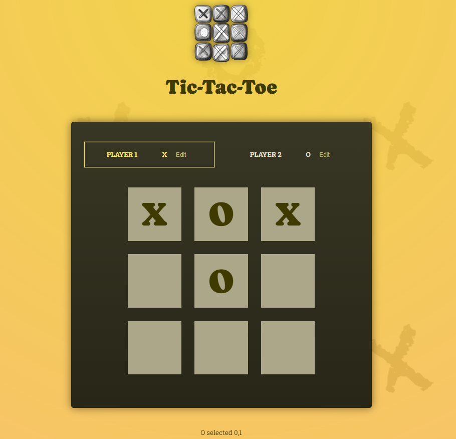

# Tic-Tac-Toe Game 🎮

A simple React-based Tic-Tac-Toe game that allows two players to take turns and determines the winner.

## Overview 🌐

This project implements a classic Tic-Tac-Toe game using React. Players can make moves by clicking on the game board, and the winner or a draw is determined after each move.


## Technologies Used 💻

- **React**

## Usage 🕹️

1. Clone the repository to your local machine.
2. Navigate to the project directory.
3. Open the terminal and run the following command to install dependencies:

```bash
npm install
```

- Start the project with:
```bash
npm start
```
- Open your browser and visit http://localhost:3000 to play the Tic-Tac-Toe game.

## How to Play 🎲

- Click on an empty square to make a move.
- The game alternates between "X" and "O" symbols for each player.
- The game announces the winner or a draw after each move.
- Click the "Rematch" button to start a new game.



## Live Demo 🌐
Live Demo: [Tic-Tac-Toe Demo](https://tic-tac-toe-one-navy-95.vercel.app/)

## Contributing 🤝
Feel free to use, modify, and contribute to the project! If you have any questions or feedback, you can reach me at your nisagokdemir@gmail.com

## License
This project is licensed under the **MIT License**.
